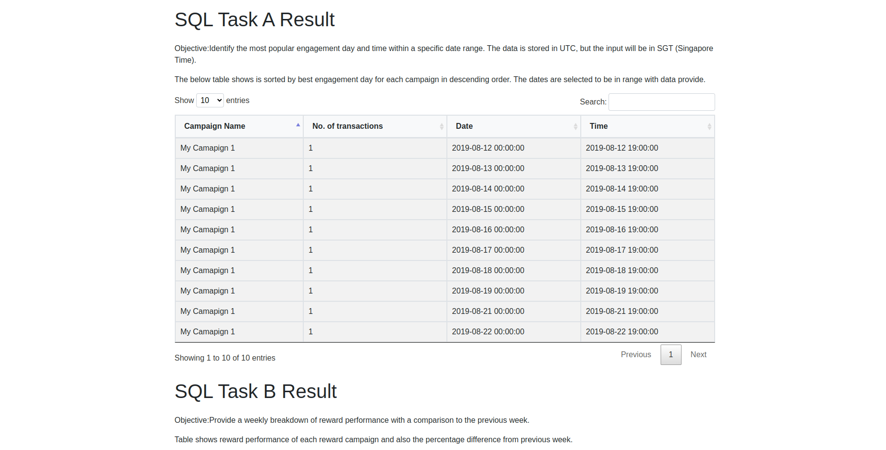

# Perx Data Engineer Test Task

## Project Overview

This project is an implementation of the Perx Data Engineer test task, providing a Docker-based solution to load data into a database and generate reports.

## Project Structure

The project structure is as follows:

```
-app
    -templates
     - index.html
    -app.py
    -config,py
    -db.py
    -Dockerfile
    -requirements.txt
-config.py
-db.py
-docker-compose.yml 
-Dockerfile
-.env
-main.py
-models.py
-readme.md
-requirements.txt
-results.py
-setup.py
```


## Setup and Running

To set up and run the project:

1. Ensure Docker and Docker Compose are installed on your system.
2. In the project directory, execute the following command:

   ```bash
   docker-compose up
   ```

This command will build and start the containers defined in the `docker-compose.yml` file. It will fetch the PostgreSQL image if not already present, create a network and volume for the project if they don't exist, and set up a user `admin` for database interaction. The three containers include:

-   **Database Container**: Manages the PostgreSQL database.
-   **Data Processing Container**: Loads data and generates reports.
-   **Flask App Container**: Displays the generated results.

## Data Loading and Processing

Data is loaded from a CSV file located in a Git repository. The CSV file is pulled from GitHub into a Pandas DataFrame. After processing, the data is stored in the database using SQLAlchemy. The `models.py` file defines five SQLAlchemy models representing the database tables.

## Problem Statements

### SQL Test Task A

**Objective**:  Identify the most popular engagement day and time within a specific date range. The data is stored in UTC, but the input will be in SGT (Singapore Time).


**Expected Output**:

-   Number of Transactions
-   Date
-   Time

**Sample Results**:

```sql
WITH transactions_in_range AS (
        SELECT 
            rt.id,
            rt.reward_campaign_id,
            rt.updated_at AT TIME ZONE 'UTC' AS utc_time,
            rt.updated_at AT TIME ZONE 'UTC' AT TIME ZONE 'SGT' AS sgt_time,
            rc.campaign_id
        FROM reward_transaction rt
        JOIN reward_campaign rc ON rt.reward_campaign_id = rc.id
        WHERE rt.updated_at AT TIME ZONE 'UTC' AT TIME ZONE 'SGT' BETWEEN '{start_date}' AND '{end_date}'
    ),
    campaign_transactions AS (
        SELECT 
            tr.reward_campaign_id,
            c.name AS campaign_name,
            COUNT(tr.id) AS no_of_transactions,
            DATE_TRUNC('day', tr.sgt_time) AS date,
            DATE_TRUNC('hour', tr.sgt_time) AS time
        FROM transactions_in_range tr
        JOIN campaign c ON tr.campaign_id = c.id
        GROUP BY tr.reward_campaign_id, c.name, DATE_TRUNC('day', tr.sgt_time), DATE_TRUNC('hour', tr.sgt_time)
    ),
    max_transactions AS (
        SELECT 
            reward_campaign_id,
            MAX(no_of_transactions) AS max_transactions
        FROM campaign_transactions
        GROUP BY reward_campaign_id
    )
    SELECT 
        ct.campaign_name,
        ct.no_of_transactions,
        ct.date,
        ct.time
    FROM campaign_transactions ct
    JOIN max_transactions mt ON ct.reward_campaign_id = mt.reward_campaign_id AND ct.no_of_transactions = mt.max_transactions
    ORDER BY ct.no_of_transactions DESC;
```

| Campaign Name  | No. of transactions | Date                | Time                |
|----------------|----------------------|---------------------|---------------------|
| My Camapign 1  | 1                    | 2019-08-12 00:00:00 | 2019-08-12 19:00:00 |
| My Camapign 1  | 1                    | 2019-08-13 00:00:00 | 2019-08-13 19:00:00 |
| My Camapign 1  | 1                    | 2019-08-14 00:00:00 | 2019-08-14 19:00:00 |


### SQL Test Task B

**Objective**: Provide a weekly breakdown of reward performance with a comparison to the previous week.

**Expected Output**:

-   Reward Name
-   Reward Redeemed Count
-   Percentage Difference from Previous Week
-   Date/Week

**Sample Results**:

```sql
WITH weekly_counts AS (
        SELECT 
            rt.reward_campaign_id,
            rc.reward_name,
            DATE_TRUNC('week', rt.updated_at::timestamp) AS week_start,
            COUNT(*) AS total_redeemed
        FROM 
            reward_transaction rt
        JOIN
            reward_campaign rc
        ON
            rt.reward_campaign_id = rc.id
        WHERE 
            rt.status = 'redeemed'
        GROUP BY 
            rt.reward_campaign_id, 
            rc.reward_name,
            week_start
    ),

    weekly_counts_with_diff AS (
        SELECT 
            reward_campaign_id,
            reward_name,
            total_redeemed,
            week_start,
            LAG(total_redeemed) OVER (PARTITION BY reward_campaign_id ORDER BY week_start) AS prev_week_total_redeemed
        FROM 
            weekly_counts
    )

    SELECT
        reward_name AS "Reward Name",
        total_redeemed AS "Reward Redeemed Count",
        COALESCE(
            ROUND(
                ((total_redeemed - prev_week_total_redeemed) * 100.0) / NULLIF(prev_week_total_redeemed, 0), 2
            ), 
            0
        ) AS "Percentage Difference as per Previous Week",
        week_start AS "Week"
    FROM
        weekly_counts_with_diff
    ORDER BY
        reward_campaign_id,
        week_start;
```

| Reward name | Reward Redeemed count | Percentage difference as per previous week | Week                |
|-------------|-----------------------|---------------------------------------------|---------------------|
| My Reward   | 7                     | 0.0                                         | 2019-08-12 00:00:00 |
| My Reward   | 3                     | -57.14                                     | 2019-08-19 00:00:00 |


### HTTP Analyze Task

**Objective**: Analyze campaign performance based on HTTP log data. Generate a report including user sessions, campaigns viewed, rewards issued, and whether a reward was driven by a campaign view. 

**Expected Output**:

-   User ID
-   Session Start (Timestamp)
-   Session End (Timestamp)
-   Campaigns: List of campaigns the user viewed
-   Rewards Issued: List of rewards issued to the user
-   Reward Driven by Campaign View: True if a reward was issued after viewing a campaign containing the reward within the session

**Sample Results**:

```python
def analyze_user_sessions(connection):

    # Read HTTP log data
    http_log_df = pd.read_sql("SELECT * FROM http_log", connection)

    # Read campaign-reward mapping data
    campaign_reward_df = pd.read_sql("SELECT * FROM reward_campaign_relationship", connection)

    # Ensure timestamp is in datetime format
    http_log_df['timestamp'] = pd.to_datetime(http_log_df['timestamp'])

    # Sort the DataFrame by user_id and timestamp
    http_log_df = http_log_df.sort_values(by=['user_id', 'timestamp'])

    # Calculate the difference between consecutive timestamps for each user
    http_log_df['prev_timestamp'] = http_log_df.groupby('user_id')['timestamp'].shift(1)
    http_log_df['time_diff'] = (http_log_df['timestamp'] - http_log_df['prev_timestamp']).dt.total_seconds()

    # Identify session boundaries (more than 5 minutes gap)
    http_log_df['session_boundary'] = (http_log_df['time_diff'] > 300) | (http_log_df['prev_timestamp'].isnull())

    # Assign session IDs by cumulatively summing the session boundaries
    http_log_df['session_id'] = http_log_df.groupby('user_id')['session_boundary'].cumsum()

    # Aggregate session data
    user_sessions_df = http_log_df.groupby(['user_id', 'session_id']).agg(
        session_start=('timestamp', 'min'),
        session_end=('timestamp', 'max'),
        campaigns=('http_path', lambda x: list(x[http_log_df['http_method'] == 'GET'].str.split('/').str[2].astype(int))),
        rewards_issued=('http_path', lambda x: list(x[http_log_df['http_method'] == 'POST'].str.split('/').str[2].astype(int)))
    ).reset_index()

    # Create a campaign-reward mapping dictionary
    campaign_reward_map = campaign_reward_df.groupby('campaign_id')['reward_id'].apply(list).to_dict()

    # Define a function to check if rewards are driven by campaign views
    def check_rewards(campaigns, rewards):
        if not rewards or not campaigns:
            return False
        
        # Flatten the list of rewards for easier comparison
        flattened_rewards = [str(reward) for reward in rewards]
        
        for campaign in campaigns:
            str_campaign = str(campaign)
            if str_campaign in campaign_reward_map:
                # Check if any reward in rewards matches the map for the campaign
                if any(str(reward) in campaign_reward_map[str_campaign] for reward in flattened_rewards):
                    return True
        return False

    # Apply the function to the user sessions DataFrame
    user_sessions_df['reward_driven_by_campaign_view'] = user_sessions_df.apply(
        lambda row: check_rewards(row['campaigns'], row['rewards_issued']), axis=1)
    user_sessions_df['reward_driven_by_campaign_view'] = user_sessions_df['reward_driven_by_campaign_view'].astype(bool)


    # Show the result
    print(user_sessions_df[user_sessions_df['reward_driven_by_campaign_view']])

    # return the user sessions report
    return user_sessions_df
```

| User Id | Session start         | Session end           | campaigns  | rewards_issued | reward_driven_by_campaign_view |
|---------|-----------------------|-----------------------|------------|----------------|--------------------------------|
| 1009125 | 2019-08-27 03:20:49   | 2019-08-27 03:20:49   | [1127]    | []             | False                             |
| 1014506 | 2019-08-26 17:25:19   | 2019-08-26 17:26:54   | [11,11,11] | [7993]         | False                         |
| 1018910 | 2019-08-26 19:10:43   | 2019-08-26 19:10:43   | [1788]     | []             | False                             |
| 1021245 | 2019-08-27 03:09:59   | 2019-08-27 03:09:59   | [1128]     | []             | False                             |


## Results
ALl the reports can be viewed via a dashboard at [http://127.0.0.1:5000](http://127.0.0.1:5000). This dashboard is created with a Flask application which is querying the results saved in the database.<br>
Screenshot of the dashboard:



## Files and Their Purpose

-   **`app/`**: Contains the Flask application and configuration files.
-   **`config.py`**: Configuration settings for the application.
-   **`db.py`**: Database connection and management.
-   **`docker-compose.yml`**: Defines the services, networks, and volumes for Docker Compose.
-   **`Dockerfile`**: Instructions to build the Docker image.
-   **`.env`**: Environment variables for the project.
-   **`main.py`**: Entry point for the application.
-   **`models.py`**: SQLAlchemy models representing database tables.
-   **`README.md`**: Project documentation.
-   **`requirements.txt`**: Python dependencies for the project.
-   **`results.py`**: Script for generating results and reports.
-   **`setup.py`**: Setup script for the project.